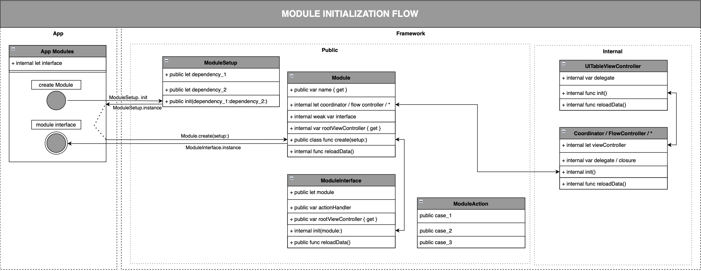
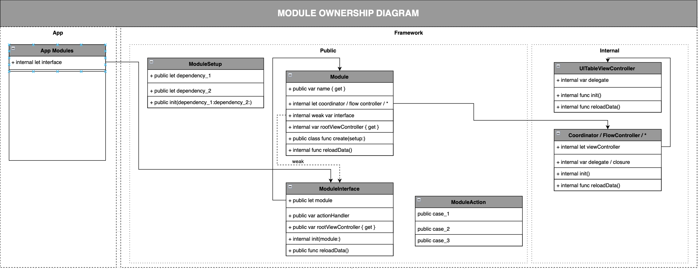
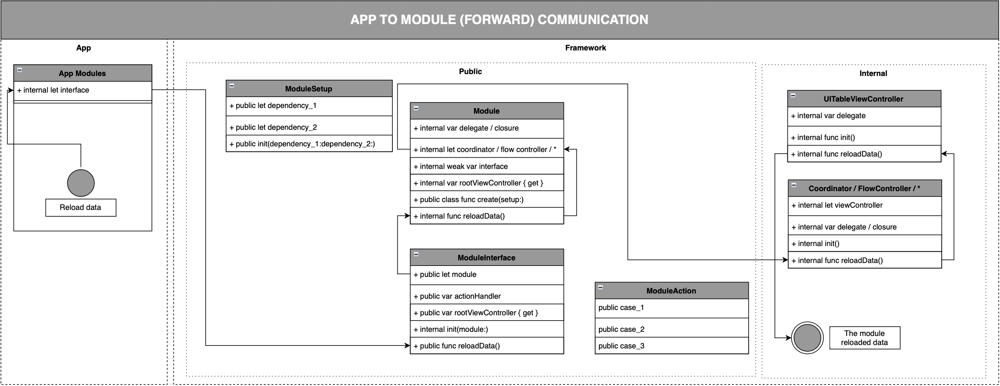
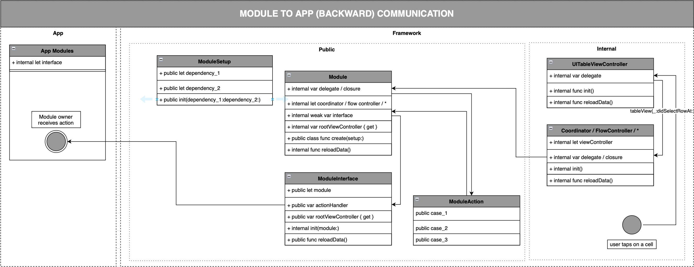

# BitriseClient

Welcome to the **BitriseClient** project. It serves the purpose of showing app modularisation on a real business case. The application itself is a simple API client that shows some basic info about Bitrise applications.

The project was created for the purpose of internal Netguru hackathon performed on Jul 18, 2022. Main goal was to perform a test and validate the thesis:
 ```
 20 developers can work efficiently on the same project. The project they have not worked before and is rather simple. They can deliver good results in 4 hours.
 ```
 The project was opartially prepared before the event to allow teams work more efficiently during time limited event. Originally it was developed using different repository. It contained confidential information, that part was stripped and the project is available in new repository with cleared git history.

The initial project architecture and solutions used there were created by [Siemian](https://github.com/Siemian) and [PatrykKaczmarek](https://github.com/PatrykKaczmarek). Where the implementation of particular modules were done by the other Netguru iOS team members during the hackhaton.

## Configuration

### Prerequisites
Things that you need to have before start working with a project.
<!-- This should be rather obvious for an iOS Dev, but could be helpful for anyone else. -->

- [Ruby](https://rubygems.org)
- [Bundler](http://bundler.io) (`gem install bundler`)
- [Homebrew](https://brew.sh)
- [Carthage](https://github.com/Carthage/Carthage) (`brew install carthage`)
- [CocoaPods](https://cocoapods.org) (`brew install cocoapods`)
- [Xcodegen](https://github.com/yonaskolb/XcodeGen) (`brew install xcodegen`)
- [Xcode 15](https://developer.apple.com/Xcode) (iOS SDK 17)

### Installation

1. Clone repository
2. Install required Gems:
	```bash
	bundle install
	```
3. Run Carthage:
 	```bash
 	carthage bootstrap --platform iOS --cache-builds
 	```
4. Regenerate project files and run pods:
 	```bash
 	swift regenerate_projects.swift
 	```
5. Set up SwiftFormat (more info below).
6. Update git hooks to use predefined versions.
 	```bash
 	chmod +x .githooks/pre-commit
 	git config core.hooksPath .githooks
 	```
7. Open `BitriseClient.xcworkspace` file and build the project.

## Code Style guidelines and Linters

### Implementing Code Style guidelines with SwiftLint

 When committing to the repository, please, format your code according to the team code style guide.<br>To automatically point out any discrepancies, please use [SwiftLint](https://github.com/realm/SwiftLint) tool which is currently integrated via postBuild script for every target.

### Enforcing common Code Style with SwiftFormat

There is a tool called [SwiftFormat](https://github.com/nicklockwood/SwiftFormat) that can fix some issues in your code automatically.<br>You enable usage of SwiftFormat as a pre-commit git hook.

## Code Quality guidelines

- Respect Swift [API Design Guidelines](https://swift.org/documentation/api-design-guidelines/)

## Project guide

### Modules structure
Project uses a modular architecture in order to allow different teams working on the same app in an efficient and controllable way. Currently the project is divided into multiple modules, which splits into two categories:
 - domain modules
 - common modules
and the app itself.

Full dependency graph can be found bellow:


Each module consists of 3 targets:
- framework - the core implementation of the module
- test target - the unit tests for the framework
- demo app - the app that launches the module in a separate environment in order to test it independently
In fact, every module is wrapped by a separate `.xcodeproj`. The genuine app wraps all projects into one `.xcworkspace`.

**IMPORTANT:**
> To use the module either in the app or the demo app, you need to import it.

### Module architecture

Every module consists of 4 predefined files which are the must to keep modules unified:

- `{module_name}Module.swift` - a class that should be used to initialize the module.
- `{module_name}ModuleSetup.swift` - a class that contains all dependencies required by the module to work properly.
- `{module_name}ModuleAction.swift` - an enum that contains all actions that goes outside the module.
- `{module_name}ModuleInterface.swift` - a class that contains the 2way communication interface: to the module and outside of it (through `{module_name}ModuleAction`).

Such module definition has been composed this way to allow the developer to choose the correct architecture per module. Some modules might be relatively small and easy, thus complex architecture might not be needed. On the other hand, the rest modules might be complex and hard to handle, thus requiring a readable and well-designed architecture. There is only one requirement to meet. The module must expose `rootViewController` in order to embed it in the app's current view hierarchy. This is achieved automatically by adopting the `ModuleInterface` protocol, which every domain module does by default.

Check [Module .xctemplate](#module-xctemplate) section to read about automated modules creation.

**IMPORTANT:**
> It's strongly encouraged to use one architecture across all modules to increase maintainability. However, this is not a must.

### Module initialization flow

To show, how all generated classes are connected to each other, what they do, and what responsibilities they have, look at the following diagram:



### Module ownership diagram

To understand the memory management within the module, take a look at the following diagram:



### Module 2way communication flow

There are possible scenarios of communication:
- the app wants to trigger a known behavior within the module. All behaviors are wrapped by the API exposed in `ModuleInterface`. This is called **forward** communication because the receiver is **known**.
- the module wants to inform about the action/event that happened within the module and cannot (or should not) be handled by itself. The module informs the receiver through `ModuleInterface` by invoking `actionHandler` closure. This is called **backward** communication because the receiver is **unknown**.

Following diagrams present both cases:





### Modules lifecycle

To avoid having dangling pointers or retain cycles, the app contains a class called `ModulesContainer` which stores memory pointers to initialized modules. This is the generic class whose responsibility is to store in the memory only one instance of a module of the particular type.

**IMPORTANT:**
> Every module can be stored in the memory only once. There is no way to create two instances of the same module when using `ModulesContainer` API.

> Module is stored in the memory until manually released.

The project also contains the `AppModules` struct that composes the `ModulesContainer` class and provides strongly typed access to the modules. By default, common modules are stored in the memory all the time (through stored variables) when domain modules are created on-demand.

**IMPORTANT:**
> When a domain module is no longer necessary, release it by invoking `AppModules.release(module:)` API.

### Demo Apps

Besides using modules in the genuine app, you can play with the implementation exposed by the module's public API in the demo app. Every demo app can be launched independently, so the newly written implementation can be checked immediately, even if the other module is not ready yet.

**IMPORTANT:**
> Demo app is the sandbox for you! Feel free to use it to test what you want in a way you want.

Here are some examples of how to properly use demo apps:
- `Networking` - in Demo App, you can provide a POSTMAN-like interface for defining requests and checking the content of responses.
- `BitriseAuthentication` - in Demo App, you can provide the UI for obtaining an access token which can be easily copied to other development tools.
- `CommonUI` - think of it as a views browser. As a developer, you can quickly check which UI components are shared, how they look like, what can be customized, and how much they're adaptive.
- etc.

### Module .xctemplate

To maintain consistency in the project and facilitate simultaneous work, the Xcode template `Module.xctemplate` was created. You should use it while creating a new module which should be attached to the main application.

**Prerequisite (to be done once):** copy `Module.xctemplate` directory to:

```bash
~/Library/Developer/Xcode/Templates/File Templates/Custom Templates/
```

1. Navigate to a place in the `.pbxproj` tree where the module should be generated. It's strongly encouraged to embed it in the `Public/` subdirectory.
2. Open a "new file from template" dialog (File -> New File, shortcut: ⌘ + N).
3. Scroll vertically from within the `iOS` tab to see the `Custom Templates` section.
4. Double click on the `Module` tile
5. Provide a name for the module.
6. Confirm the place where files should be created and their membership to a framework target.
7. Xcode will generate 4 files for you (as mentioned in [Module Architecture](#module-architecture) section:
    - `{module_name}Module.swift`
    - `{module_name}ModuleSetup.swift`
    - `{module_name}ModuleAction.swift`
    - `{module_name}ModuleInterface.swift`
8. Generated files contain some placeholders to fill in order to work properly.

## Resources
 - [Mockups](./Docs/mockups.png)
 - [Modules description](./Docs/modules_definition.png)
 - [Dependency Graph](./Docs/bitrise_client-dependency_graph.png)
 - [Bitrise API](https://api-docs.bitrise.io)

 # Contributing

Pull requests and issues are always welcome. Please open any issues and PRs for bugs, features, or documentation. SLA for resolving issues is set to 30 working days.

Current repo maintainer: [Siemian](https://github.com/Siemian)

# License

This project is available as open source under the terms of the [MIT License](https://opensource.org/licenses/MIT).

